# Image Trace 完整架构与数据流（代码实读版）

> 基于仓库当前代码（`backend_simplified/`、`ui/`、`desktop/`）整理。目标：用多视角 Mermaid 图展示项目每个核心模块的数据流动方式、数据库结构与文件系统流。

## 1. 系统全景（Context + Layer）

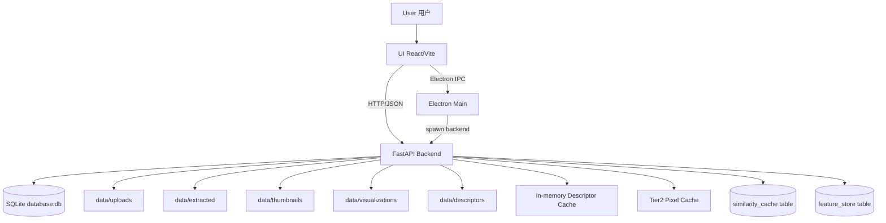

## 2. 项目模块地图（按代码目录）

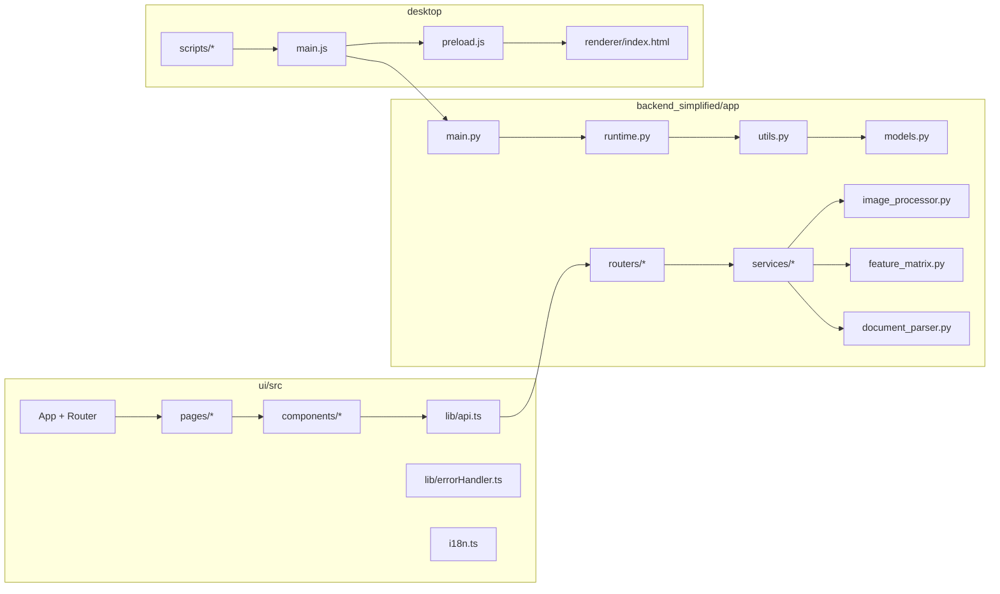

## 3. 后端总数据流（请求视角）

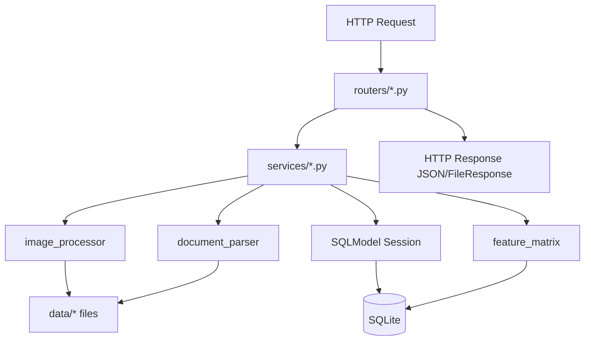

## 4. 启动初始化流（FastAPI lifespan）

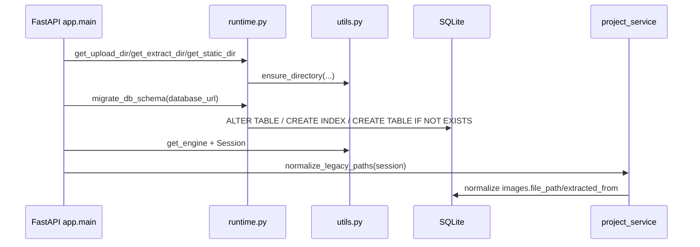

## 5. 上传图片流（`POST /upload`，图片文件）

```mermaid
flowchart TB
    A1[Client upload image] --> A2[uploads.py upload_file]
    A2 --> A3[sanitize_filename + save_upload_file]
    A3 --> A4[upload_service.process_uploaded_file]
    A4 --> A5[image_processor.compute_image_features]
    A5 --> A6[(images table insert)]
    A6 --> A7[enqueue_precompute]
    A7 --> A8[runtime.ensure_precompute]
    A8 --> A9[bg_precompute_features thread/background task]
    A9 --> A10[feature_matrix.precompute_feature_matrix]
    A10 --> A11[(feature_store upsert by image/variant/algo)]
    A10 --> A12[images.feature_status: pending->computing->ready]
    A4 --> A13[Response processed_images[]]
```

## 6. 上传文档提取流（`POST /upload`，PDF/DOCX/PPTX）

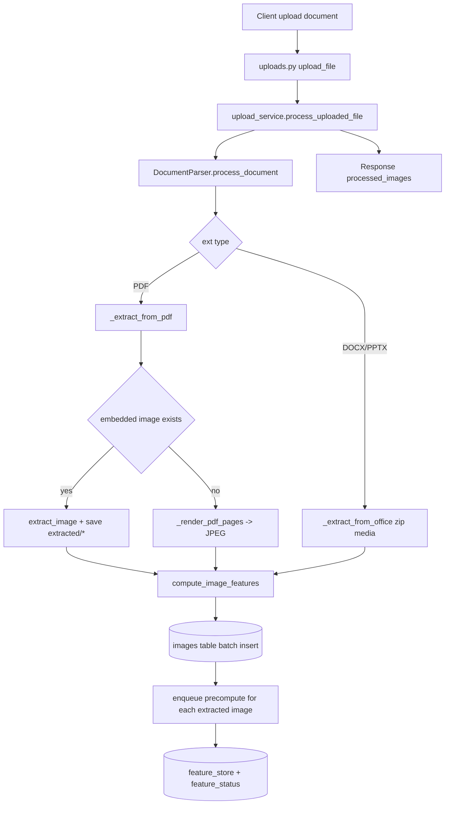

## 7. 常规比对流（`POST /compare/{project_id}`）

```mermaid
flowchart TB
    C1[analysis.py /compare] --> C2[analysis_run_service.execute_compare_analysis]
    C2 --> C3[require_project + load images]
    C3 --> C4[_build_image_dicts]
    C4 --> C5{algo type}

    C5 -->|descriptor| C6[get_cached_descriptor(memory/disk/compute)]
    C5 -->|pixel| C7[ssim/histogram/template scorer]
    C5 -->|hash| C8[calculate_similarity hash]
    C5 -->|auto| C9[calculate_hybrid_similarity]

    C6 --> C10[group_similar_by_metric]
    C7 --> C10
    C8 --> C10
    C9 --> C10

    C10 --> C11[build SimilarGroup + unique_images]
    C11 --> C12[_persist_analysis_run]
    C12 --> C13[(analysis_runs.summary JSON)]
    C12 --> C14[ComparisonResult response]
```

## 8. 智能查重流（`POST /smart_compare/{project_id}`）

```mermaid
flowchart TB
    S1[smart_compare endpoint] --> S2[_validate_smart_compare_inputs]
    S2 --> S3{all images feature_status==ready?}
    S3 -->|no| S4[return features_pending summary]
    S3 -->|yes| S5[for algo in SMART_ALGOS]

    S5 --> S6[compute_similarity_matrix_fast(session,image_ids,algo,rotation=true)]
    S6 --> S7[collect pair_hits if score>=threshold]
    S7 --> S8[_build_duplicate_groups]
    S8 --> S9[gate: min_agree + hash_algo_present]
    S9 --> S10[Union-Find connected components]
    S10 --> S11[duplicate_groups + confidence + matched_algorithms]
    S11 --> S12[summary/scan_seconds response]
```

## 9. 矩阵引擎流（`feature_matrix.py`）

```mermaid
flowchart TB
    M1[precompute_feature_matrix(image)] --> M2[generate 8 orientation variants]
    M2 --> M3[compute ALL_FEATURES per variant]
    M3 --> M4[vector_to_b64]
    M4 --> M5[(feature_store rows)]

    M6[compute_similarity_matrix_fast] --> M7[load_feature_vectors from feature_store]
    M7 --> M8{feature type}
    M8 -->|*_bits| M9[compute_hash_similarity_matrix XOR+popcount]
    M8 -->|others| M10[compute_cosine_similarity_matrix BLAS mat@mat.T]
    M9 --> M11[NxN similarity matrix]
    M10 --> M11
```

## 10. 配对缓存与像素缓存流（`image_processor.py`）

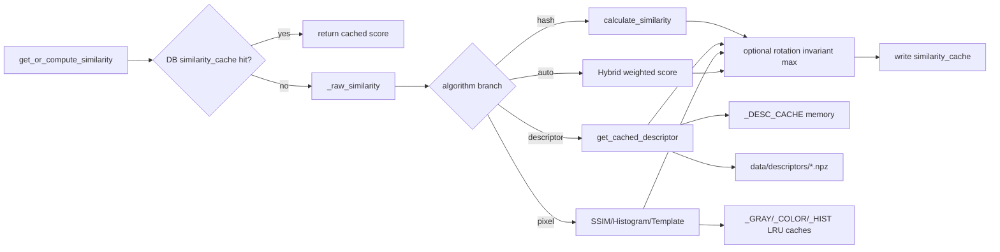

## 11. 报告与可视化数据流

```mermaid
flowchart TB
    R1[/pairwise_matrix] --> R2[analysis_service.compute_pairwise_matrix_payload]
    R2 --> R3{features ready + algo mapped?}
    R3 -->|yes| R4[matrix engine]
    R3 -->|no| R5[legacy get_or_compute_similarity pairwise loops]
    R4 --> R6[matrix payload response]
    R5 --> R6

    V1[/match_data] --> V2[build_match_data_response]
    V2 --> V3[OpenCV detect keypoints + ratio test]
    V3 --> V4[compact keypoints/matches JSON]

    V5[/visualize_match] --> V6[draw_feature_matches]
    V6 --> V7[data/visualizations/match_*.jpg]
    V7 --> V8[file_path response]

    RP1[/report/{project_id}] --> RP2[build_project_report]
    RP2 --> RP3[cluster by threshold + pair_matches]
    RP3 --> RP4[full printable report JSON]
```

## 12. 删除流程与缓存失效流

```mermaid
flowchart TB
    X1[DELETE /images/{id}] --> X2[project_service.delete_image_artifacts]
    X2 --> X3[delete source file]
    X2 --> X4[delete thumbnails]
    X2 --> X5[invalidate_feature_cache(path)]
    X2 --> X6[invalidate_similarity_cache(file_hash)]
    X2 --> X7[delete feature_store rows]
    X7 --> X8[session.delete(image)+commit]

    Y1[DELETE /projects/{id}] --> Y2[iterate images -> delete_image_artifacts]
    Y2 --> Y3[delete analysis_runs]
    Y3 --> Y4[delete project]
```

## 13. 前端数据流总览

```mermaid
flowchart TB
    F0[main.tsx] --> F1[App.tsx]
    F1 --> F2[BackendGate]
    F1 --> F3[HashRouter routes]

    F3 --> F4[Dashboard]
    F3 --> F5[ProjectDetail]
    F3 --> F6[DuplicateReport]

    F4 --> F7[getProjects/createProject/deleteProject]
    F5 --> F8[getProject/getProjectImages]
    F5 --> F9[uploadImages/uploadDocument]
    F5 --> F10[analyzeImages/smartCompare]
    F5 --> F11[getPairwiseMatrix/getAnalysisRuns/getAnalysisRunDetail]
    F5 --> F12[getMatchData]
    F6 --> F13[fetch /report/{project_id}]

    F7 --> API[lib/api.ts fetch wrapper]
    F8 --> API
    F9 --> API
    F10 --> API
    F11 --> API
    F12 --> API
    F13 --> API

    API --> BE[FastAPI]
```

## 14. `ProjectDetail` 页面内状态-事件流

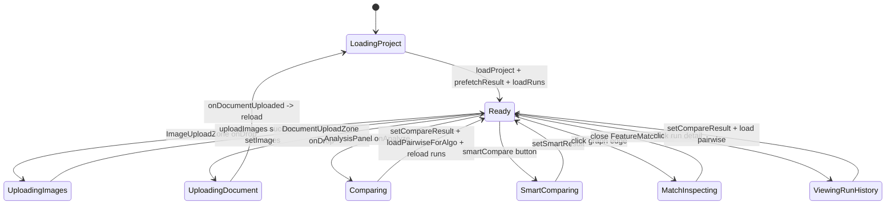

## 15. `BackendGate` + Electron IPC 握手流

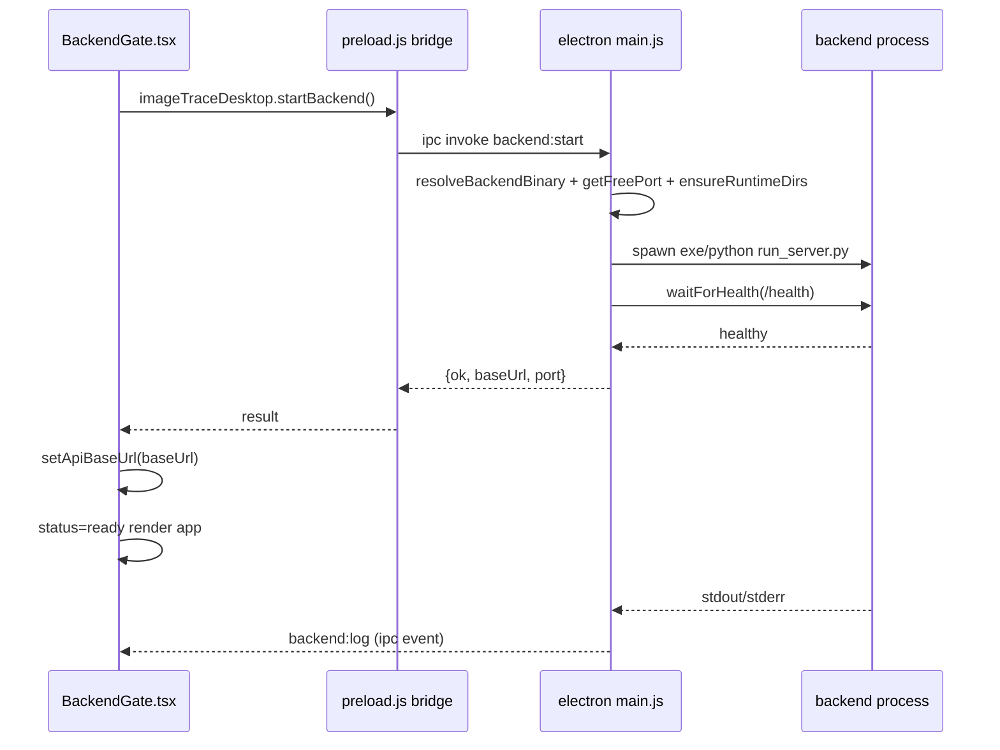

## 16. Electron 后端启动回退策略图

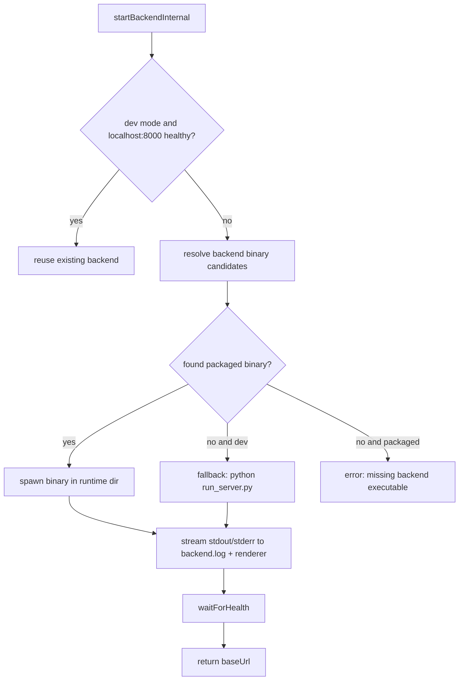

## 17. 构建与打包数据流（desktop/scripts）

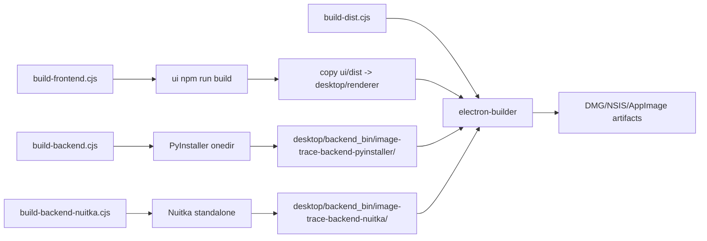

## 18. 数据库 ER 图（`models.py` + 迁移逻辑）

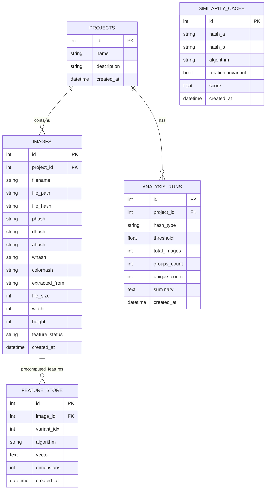

## 19. 数据库索引/约束视图

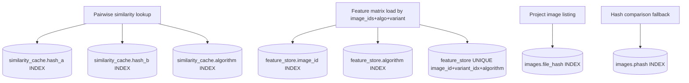

## 20. `feature_status` 状态机（图片特征预计算）

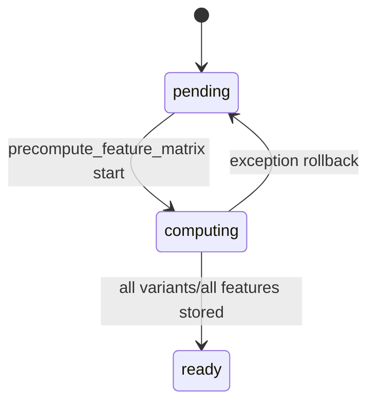

## 21. 文件系统数据产物流

```mermaid
flowchart TB
    UPL[upload input files] --> F1[data/uploads]
    DOC[document parser outputs] --> F2[data/extracted]
    TH[thumbnail endpoint] --> F3[data/thumbnails]
    VIS[visualize_match endpoint] --> F4[data/visualizations]
    DSC[get_cached_descriptor] --> F5[data/descriptors/{algo}/{hash}.npz]

    F1 --> IMGDB[(images.file_path)]
    F2 --> IMGDB
    F3 --> API1[/thumbnail/{id} FileResponse]
    F4 --> API2[/visualize_match file_path]
    F5 --> DESCFLOW[descriptor cache warm start]
```

## 22. 错误与恢复流（跨层）

```mermaid
flowchart TB
    FE_ERR[Frontend APIError/ErrorBoundary] --> TOAST[Toast + copy error]
    FE_ERR --> RETRY1[manual refresh/retry actions]

    BE_ERR1[Router validation errors 400/404] --> FE_ERR
    BE_ERR2[Service/runtime exceptions 500] --> FE_ERR

    CACHE_MISS[cache miss] --> COMPUTE[recompute path]
    COMPUTE --> CACHE_WRITE[write cache/store]

    FEATURE_PENDING[smart compare features_pending] --> USER_WAIT[user wait/recomputeFeatures]
    USER_WAIT --> RETRY2[smartCompare retry]
```

## 23. 模块职责与数据输入/输出（精简表）

```mermaid
flowchart LR
    R_UPLOAD[routers/uploads.py] --> S_UPLOAD[services/upload_service.py]
    R_ANALYSIS[routers/analysis.py] --> S_RUN[services/analysis_run_service.py]
    R_ANALYSIS --> S_ANALYSIS[services/analysis_service.py]
    R_PROJECTS[routers/projects.py] --> S_PROJECT[services/project_service.py]
    R_FILES[routers/files.py] --> S_PROJECT

    S_UPLOAD --> CORE_DOC[document_parser.py]
    S_UPLOAD --> CORE_IMG[image_processor.py]
    S_RUN --> CORE_IMG
    S_RUN --> CORE_MAT[feature_matrix.py]
    S_ANALYSIS --> CORE_MAT
    S_ANALYSIS --> CORE_IMG

    CORE_IMG --> M_IMG[(images)]
    CORE_MAT --> M_FEA[(feature_store)]
    S_RUN --> M_RUN[(analysis_runs)]
    CORE_IMG --> M_SIM[(similarity_cache)]
```

## 24. 前端业务组件数据流（不含纯 UI 原子组件）

```mermaid
flowchart TB
    C_DASH[Dashboard] --> C_CREATE[CreateProjectDialog]
    C_DASH --> C_CARD[ProjectCard]
    C_DASH --> C_HEALTH[SystemHealth]

    C_DETAIL[ProjectDetail] --> C_IMG_UP[ImageUploadZone]
    C_DETAIL --> C_DOC_UP[DocumentUploadZone]
    C_DETAIL --> C_PANEL[AnalysisPanel]
    C_DETAIL --> C_SMART[SmartCompareResultView]
    C_DETAIL --> C_MAT[SimilarityMatrix]
    C_DETAIL --> C_GRAPH[SimilarityGraph]
    C_DETAIL --> C_MATCH[FeatureMatchView]

    C_REPORT[DuplicateReport] --> C_API_REPORT[/report API fetch]

    C_IMG_UP --> API1[uploadImages]
    C_DOC_UP --> API2[uploadDocument]
    C_PANEL --> API3[analyzeImages]
    C_SMART --> API4[smartCompare/recomputeFeatures]
    C_GRAPH --> C_MATCH
    C_MATCH --> API5[getMatchData]
```

---

以上图谱从 **请求流、计算流、缓存流、存储流、桌面运行时流、构建发布流、数据库结构流** 六个角度覆盖了当前项目核心模块的数据流。

## 25. API Endpoint 到后端模块映射流

```mermaid
flowchart LR
    subgraph EP[FastAPI Endpoints]
        EP1[/projects]
        EP2[/upload]
        EP3[/extract/{file_path}]
        EP4[/compare/{project_id}]
        EP5[/smart_compare/{project_id}]
        EP6[/results/{project_id}]
        EP7[/pairwise_matrix/{project_id}]
        EP8[/match_data]
        EP9[/visualize_match]
        EP10[/report/{project_id}]
        EP11[/thumbnail/{image_id}]
        EP12[/download/{file_path}]
    end

    EP1 --> PRJ[project_service]
    EP2 --> UP[upload_service]
    EP3 --> UP
    EP4 --> RUN[analysis_run_service]
    EP5 --> RUN
    EP6 --> RUN
    EP7 --> ANS[analysis_service]
    EP8 --> ANS
    EP9 --> IMG[image_processor]
    EP10 --> ANS
    EP11 --> PRJ
    EP12 --> PRJ

    UP --> DOC[document_parser]
    RUN --> MAT[feature_matrix]
    RUN --> IMG
    ANS --> MAT
    ANS --> IMG
```

## 26. 比对算法决策分流图（运行时）

```mermaid
flowchart TB
    A0[hash_type input] --> A1{hash_type belongs to}
    A1 -->|phash/dhash/ahash/whash/colorhash| A2[HASH path]
    A1 -->|ssim/histogram/template| A3[PIXEL path]
    A1 -->|orb/brisk/sift/akaze/kaze| A4[DESCRIPTOR path]
    A1 -->|auto| A5[FUSION path]

    A2 --> A6[calculate_similarity]
    A3 --> A7[SSIM or Histogram or Template scorer]
    A4 --> A8[get_cached_descriptor + BFMatcher similarity]
    A5 --> A9[weighted hybrid score]

    A6 --> A10{rotation_invariant?}
    A7 --> A10
    A8 --> A10
    A9 --> A10
    A10 -->|yes| A11[compare_with_orientations / max score]
    A10 -->|no| A12[direct score]
    A11 --> A13[final score]
    A12 --> A13
```

## 27. 缓存一致性与失效传播流

```mermaid
flowchart TB
    DEL[Delete image/project] --> K1[delete source file]
    DEL --> K2[invalidate_feature_cache(path)]
    DEL --> K3[invalidate_similarity_cache(file_hash)]
    DEL --> K4[delete feature_store rows]
    DEL --> K5[delete thumbnails]

    K2 --> C1[_GRAY_CACHE]
    K2 --> C2[_COLOR_CACHE]
    K2 --> C3[_HIST_CACHE]
    K3 --> C4[(similarity_cache table)]
    K4 --> C5[(feature_store table)]

    UPL[Upload/Re-upload image] --> W1[precompute_feature_matrix]
    W1 --> C5
    W1 --> S1[feature_status=ready]

    CMP[New compare request] --> R1[get_or_compute_similarity]
    R1 --> C4
    R1 --> R2[cache hit or recompute]
```

## 28. 后台并发预计算流（上传后异步）

```mermaid
sequenceDiagram
    participant UI as Frontend Upload
    participant API as /upload
    participant SVC as upload_service
    participant BG as runtime.ensure_precompute
    participant T as BackgroundTasks or Thread
    participant FM as feature_matrix.precompute_feature_matrix
    participant DB as SQLite(images/feature_store)

    UI->>API: POST multipart(file, project_id)
    API->>SVC: process_uploaded_file()
    SVC->>DB: insert image row (feature_status=pending)
    SVC->>BG: enqueue(image_id, image_path)
    BG->>T: add_task(...) or Thread.start(...)
    T->>FM: precompute for 8 variants x 11 features
    FM->>DB: feature_status=computing
    FM->>DB: insert feature_store rows
    FM->>DB: feature_status=ready
    API-->>UI: upload response returns immediately
```

## 29. 运行模式差异数据流（Web Dev vs Electron）

```mermaid
flowchart LR
    subgraph MODE1[Browser Dev Mode]
        W1[React/Vite in browser]
        W2[API_BASE default http://localhost:8000]
        W3[Developer starts backend manually]
        W1 --> W2 --> W3
    end

    subgraph MODE2[Electron Desktop Mode]
        E1[Renderer App]
        E2[BackendGate]
        E3[IPC startBackend]
        E4[Electron main spawn backend]
        E5[dynamic baseUrl 127.0.0.1:port]
        E1 --> E2 --> E3 --> E4 --> E5
        E5 --> E1
    end
```

## 30. 前端可视化链路（矩阵/图谱/特征点）

```mermaid
flowchart TB
    P1[ProjectDetail compareResult] --> V1[SimilarityMatrix]
    P1 --> V2[SimilarityGraph]
    V2 -->|edge click| V3[setMatchPair]
    V3 --> V4[FeatureMatchView]
    V4 --> V5[getMatchData API]
    V5 --> V6[match_data backend JSON]
    V6 --> V4

    P2[DuplicateReport page] --> R1[/report API]
    R1 --> R2[matrix + groups + pair_matches]
    R2 --> P2
    P2 --> R3[print/PDF export]
```

## 31. 数据谱系（Data Lineage）从原始文件到报告

```mermaid
flowchart TB
    L1[Raw file bytes upload] --> L2[data/uploads/*]
    L2 --> L3[compute_image_features]
    L3 --> L4[(images row)]
    L4 --> L5[precompute_feature_matrix]
    L5 --> L6[(feature_store vectors)]
    L6 --> L7[compute_similarity_matrix_fast]
    L7 --> L8[groups/pairs/report payload]
    L8 --> L9[UI matrix/graph/report render]
    L9 --> L10[Printable report / operator decision]
```

## 32. 数据库迁移与运行期演进流

```mermaid
flowchart TB
    M0[App startup] --> M1[migrate_db_schema(database_url)]
    M1 --> M2[PRAGMA table_info(images)]
    M2 --> M3{missing optional columns?}
    M3 -->|yes| M4[ALTER TABLE images ADD COLUMN ...]
    M3 -->|no| M5[skip]
    M4 --> M6[CREATE TABLE IF NOT EXISTS similarity_cache]
    M5 --> M6
    M6 --> M7[CREATE INDEX IF NOT EXISTS ...]
    M7 --> M8[CREATE TABLE IF NOT EXISTS feature_store]
    M8 --> M9[UNIQUE(image_id,variant_idx,algorithm)]
    M9 --> M10[commit]
```

## 33. 测试覆盖映射（测试文件 -> 模块）

```mermaid
flowchart LR
    T1[test_api.py] --> R1[routers + end-to-end API]
    T2[test_feature_matrix.py] --> M1[feature_matrix.py]
    T3[test_image_processor.py] --> M2[image_processor.py]
    T4[test_document_parser.py] --> M3[document_parser.py]
    T5[test_report_and_endpoints.py] --> M4[analysis_service/report endpoints]
    T6[test_similarity_cache.py] --> M5[similarity_cache flow]
    T7[test_smart_compare.py] --> M6[smart_compare flow]
    T8[test_utils.py] --> M7[utils.py]
    T9[test_pairwise_and_viz.py] --> M8[pairwise_matrix + visualize_match]
```
